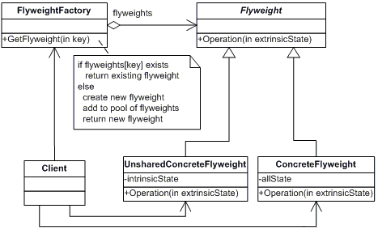

| [Home](Home.md) | [Gallery](Gallery.md) | [Examples](Examples.md) | [Downloads](Downloads.md) | [Documentation](Documentation.md) | [Project](https://sourceforge.net/projects/switchpro) | [Source](https://github.com/gammasoft71/switch) | [License](License.md) | [Contact](Contact.md) | [GAMMA Soft](https://gammasoft71.wixsite.com/gammasoft) |
|-----------------|-----------------------|-------------------------|-------------------------|-----------------------------------|-------------------------------------------------------|-------------------------------------------------|-----------------------|-----------------------|---------------------------------------------------------|

# Definition

Use sharing to support large numbers of fine-grained objects efficiently.

# UML class diagram



# Sample code

This structural code demonstrates the Flyweight pattern in which a relatively small number of objects is shared many times by different clients.

```c++
// Flyweight pattern -- Structural example
 
#include <Switch/Switch>
 
using namespace System;
using namespace System::Collections::Generic;
 
namespace DesignPatterns {
  namespace Structural {
    // The 'Flyweight' abstract class
    class Flyweight _abstract {
    public:
      virtual void Operation(int extrinsicstate) const = 0;
    };
    
    // The 'ConcreteFlyweight' class
    class ConcreteFlyweight : public Flyweight {
    public:
      void Operation(int extrinsicstate) const override {
        Console::WriteLine("ConcreteFlyweight: {0}", extrinsicstate);
      }
    };
    
    // The 'FlyweightFactory' class
    class FlyweightFactory : public object {
    public:
      // Constructor
      FlyweightFactory() {
        flyweights.Add("X", ref_new<ConcreteFlyweight>());
        flyweights.Add("Y", ref_new<ConcreteFlyweight>());
        flyweights.Add("Z", ref_new<ConcreteFlyweight>());
      }
      
      refptr<Flyweight> GetFlyweight(const string& key) const {return flyweights[key];}
 
    private:
      Dictionary<string, refptr<Flyweight>> flyweights;
    };
    
    /// @brief The 'UnsharedConcreteFlyweight' class
    class UnsharedConcreteFlyweight : public Flyweight {
    public:
      void Operation(int extrinsicstate) const override  {Console::WriteLine("UnsharedConcreteFlyweight: {0}", extrinsicstate);}
    };
    
    // MainApp startup class for Structural
    // Flyweight Design Pattern.
    class MainApp {
    public:
      // Entry point into console application.
      static void Main() {
        // Arbitrary extrinsic state
        int extrinsicstate = 22;
        
        FlyweightFactory factory;
        
        // Work with different flyweight instances
        refptr<Flyweight> fx = factory.GetFlyweight("X");
        fx->Operation(--extrinsicstate);
        
        refptr<Flyweight> fy = factory.GetFlyweight("Y");
        fy->Operation(--extrinsicstate);
        
        refptr<Flyweight> fz = factory.GetFlyweight("Z");
        fz->Operation(--extrinsicstate);
        
        refptr<UnsharedConcreteFlyweight> fu = ref_new<UnsharedConcreteFlyweight>();
        fu->Operation(--extrinsicstate);
      }
    };
  }
}
 
// Specify the Main entry point to System
_startup (DesignPatterns::Structural::MainApp)
```

# Output

```
ConcreteFlyweight: 21
ConcreteFlyweight: 20
ConcreteFlyweight: 19
UnsharedConcreteFlyweight: 18
```

# See also
​
Other Resources

* [Framework Design Guidelines](FrameworkDesignGuidelines.md)
* [Common Design Patterns](CommonDesignPatterns.md)

______________________________________________________________________________________________

© 2010 - 2017 by GAMMA Soft.
