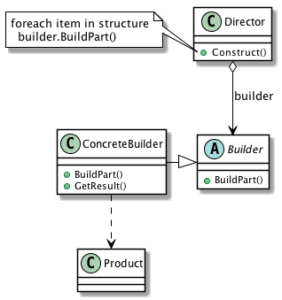

| [Home](Home.md) | [Gallery](Gallery.md) | [Examples](Examples.md) | [Downloads](Downloads.md) | [Documentation](Documentation.md) | [Project](https://sourceforge.net/projects/switchpro) | [Source](https://github.com/gammasoft71/switch) | [License](License.md) | [Contact](Contact.md) | [GAMMA Soft](https://gammasoft71.wixsite.com/gammasoft) |
|-----------------|-----------------------|-------------------------|-------------------------|-----------------------------------|-------------------------------------------------------|-------------------------------------------------|-----------------------|-----------------------|---------------------------------------------------------|

# Definition

Separate the construction of a complex object from its representation so that the same construction process can create different representations.

# UML class diagram



# Sample code

This structural code demonstrates the Builder pattern in which complex objects are created in a step-by-step fashion. The construction process can create different object representations and provides a high level of control over the assembly of the objects. 

```c++
// Builder pattern -- Creational example
 
#include <Switch/Switch>
 
using namespace System;
using namespace System::Collections::Generic;
 
namespace DesignPatterns {
  namespace Creational {
    // The 'Product' class
    class Product : public object {
    public:
      void Add(string part) {
        this->parts.Add(part);
      }
 
      void Show() const {
        Console::WriteLine("\nProduct Parts -------");
        for (const string& part : this->parts)
          Console::WriteLine(part);
        }
​
    private:
      List<string> parts;
    };
​
    // The 'Builder' abstract class
    class Builder _abstract {
    public:
      virtual void BuildPartA() = 0;
      virtual void BuildPartB() = 0;
      virtual const Product& GetResult() const = 0;
    };
 
    // The 'Director' class
    class Director : public object {
    public:
      // Builder uses a complex series of steps
      void Construct(Builder& builder) {
        builder.BuildPartA();
        builder.BuildPartB();
      }
    };
   
    // The 'ConcreteBuilder1' class
    class ConcreteBuilder1 : public Builder {
    public:
      void BuildPartA() override {this->product.Add("PartA");}
      void BuildPartB() override {this->product.Add("PartB");}
      const Product& GetResult() const override {return this->product;}
 
    private:
      Product product;
    };
 
    // The 'ConcreteBuilder2' class
    class ConcreteBuilder2 : public Builder {
    public:
      void BuildPartA() override {this->product.Add("PartX");}
      void BuildPartB() override {this->product.Add("PartY");}
      const Product& GetResult() const override {return this->product;}
 
    private:
      Product product;
    };
 
    // MainApp startup class for Creational
    // Builder Design Pattern.
    class MainApp {
    public:
      // Entry point into console application.
      static void Main() {
        // Create director and builders
        Director director;
        refptr<Builder> b1 = ref_new<ConcreteBuilder1>();
        refptr<Builder> b2 = ref_new<ConcreteBuilder2>();
​
        // Construct two products
        director.Construct(*b1);
        Product p1 = b1->GetResult();
        p1.Show();
​
        director.Construct(*b2);
        Product p2 = b2->GetResult();
        p2.Show();
      }
    };
  }
}
 
// Specify the Main entry point to System
_startup (DesignPatterns::Creational::MainApp)
```

# Output

```
Product Parts -------
PartA
PartB
​
Product Parts -------
PartX
PartY
```

# See also
​
Other Resources

* [Framework Design Guidelines](FrameworkDesignGuidelines.md)
* [Common Design Patterns](CommonDesignPatterns.md)

______________________________________________________________________________________________

© 2010 - 2017 by GAMMA Soft.
