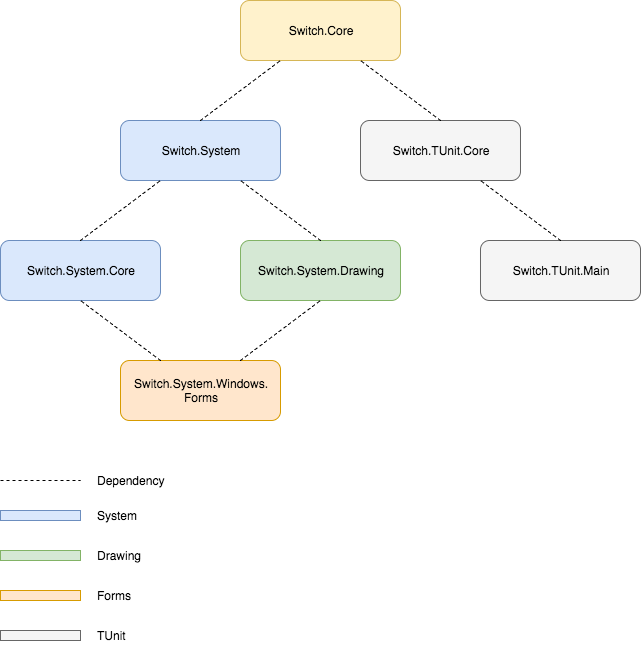

| [Home](Home.md) | [Gallery](Gallery.md) | [Examples](Examples.md) | [Downloads](Downloads.md) | [Documentation](Documentation.md) | [Project](https://sourceforge.net/projects/switchpro) | [Source](https://github.com/gammasoft71/switch) | [License](License.md) | [Contact](Contact.md) | [GAMMA Soft](https://gammasoft71.wixsite.com/gammasoft) |
|-----------------|-----------------------|-------------------------|-------------------------|-----------------------------------|-------------------------------------------------------|-------------------------------------------------|-----------------------|-----------------------|---------------------------------------------------------|

# The Switch libraries hierarchy

# Switch is composed of several libraries

These libreries are grouped by theme :

- **System** : The *Switch.Core*, *Switch.System* and *Switch.System.Core* libraries are libraries of classes, interfaces, and value types that provide access to system functionality. It is the foundation on which c++ applications, components, and controls are built.
- **Drawing** : The *Switch.System.Drawing* library contains types that support basic GDI+ graphics functionality. Child namespaces support advanced two-dimensional and vector graphics functionality, advanced imaging functionality, and print-related and typographical services. A child namespace also contains types that extend design-time user-interface logic and drawing.
- **Forms** : The *Switch.System.Windows.Forms* library contains classes for creating Windows-based applications that take full advantage of the rich user interface features available in the Microsoft Windows operating system.
- **TUnit** : The *Switch.TUnit.Core* and *Switch.Tunit.Main* libraries are a unit-testing framework for modern C++14. Initially ported from NUnit.

______________________________________________________________________________________________

© 2010 - 2017 by GAMMA Soft.
