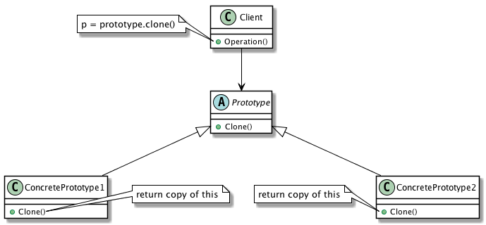

| [Home](Home.md) | [Gallery](Gallery.md) | [Examples](Examples.md) | [Downloads](Downloads.md) | [Documentation](Documentation.md) | [Project](https://sourceforge.net/projects/switchpro) | [Source](https://github.com/gammasoft71/switch) | [License](License.md) | [Gammasoft](https://gammasoft71.wixsite.com/gammasoft) |
|-----------------|-----------------------|-------------------------|-------------------------|-----------------------------------|-------------------------------------------------------|-------------------------------------------------|-----------------------|---------------------------------------------------------|

# Definition

Specify the kind of objects to create using a prototypical instance, and create new objects by copying this prototype.

Usage          Medium

# UML class diagram



# Sample code

This structural code demonstrates the Factory method offering great flexibility in creating different objects. The Abstract class may provide a default object, but each subclass can instantiate an extended version of the object.

```c++
// Prototype pattern -- Creational example
 
#include <Switch/Switch>
 
using namespace System;
 
namespace DesignPatterns {
  namespace Creational {
    // The 'Prototype' abstract class
    class Prototype abstract_ {
    public:
      // Constructor
      Prototype(const string& id) : id(id) {}
      Prototype(const Prototype& prototype) : id(prototype.id) {}
      
      // Gets id
      property_<string, readonly_> Id {
        get_ {return this->id;}
      };
      
      virtual refptr<Prototype> Clone() const = 0;
 
    private:
      string id;
    };
    
    // A 'ConcretePrototype' class
    class ConcretePrototype1 : public Prototype {
    public:
      // Constructor
      ConcretePrototype1(const string& id) : Prototype(id) {}
      
      // Returns a shallow copy
      refptr<Prototype> Clone() const override {return as<Prototype>(this->MemberwiseClone<ConcretePrototype1>());}
    };
    
    // A 'ConcretePrototype' class
    class ConcretePrototype2 : public Prototype {
    public:
      // Constructor
      ConcretePrototype2(const string& id) : Prototype(id) {}
      
      // Returns a shallow copy
      refptr<Prototype> Clone() const override {return as<Prototype>(this->MemberwiseClone<ConcretePrototype2>());}
    };
    
    // MainApp startup class for Creational
    // Prototype Design Pattern.
    class MainApp {
    public:
      // Entry point into console application.
      static void Main() {
        // Create two instances and clone each
        
        refptr<ConcretePrototype1> p1 = ref_new<ConcretePrototype1>("I");
        refptr<ConcretePrototype1> c1 = as<ConcretePrototype1>(p1->Clone());
        Console::WriteLine("Cloned: {0}", c1->Id);
        
        refptr<ConcretePrototype2> p2 = ref_new<ConcretePrototype2>("II");
        refptr<ConcretePrototype2> c2 = as<ConcretePrototype2>(p2->Clone());
        Console::WriteLine("Cloned: {0}", c2->Id);
      }
    };
  }
}
 
// Specify the Main entry point to System
startup_(DesignPatterns::Creational::MainApp);
```

# Output

```
Cloned: I
Cloned: II
```

# See also
​
Other Resources

* [Framework Design Guidelines](FrameworkDesignGuidelines.md)
* [Common Design Patterns](CommonDesignPatterns.md)

______________________________________________________________________________________________

© 2010 - 2018 by Gammasoft.
